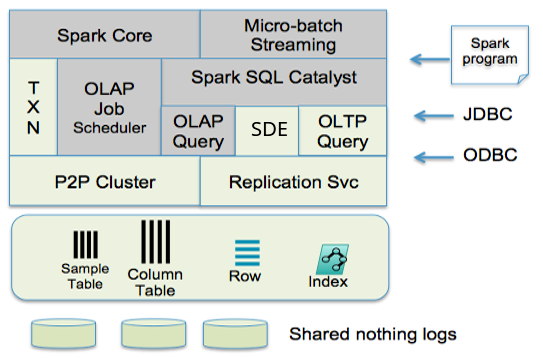
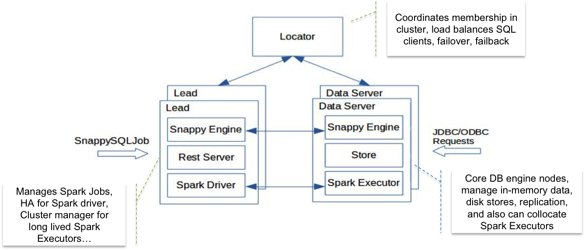
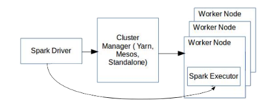

# SnappyData 简介

## SnappyData 是TIBCO高性能基于内存的数据平台.
- 2019年3月7日，官宣被TIBCO收购
`SnappyData`是一个用于混合工作负载应用程序的高性能内存数据平台。`SnappyData`构建于`Apache Spark`之上，为单个集群中的流、事务、机器学习和SQL分析提供了统一的编程模型。`SnappyData`将实时数据源与具有`Spark connector`的外部数据源统一起来。`SnappyData`与`apache spark`100%兼容，并使用`apache v2`许可证进行开源。

## 性能高
- `SnappyData`性能比`Apache Spark`快`12 - 20`倍


## 介绍
`snappydata`（又称`tibco computedb`）是一个分布式、内存优化的分析数据库。`tibco computedb`为统一分析工作负载提供高吞吐量、低延迟和高并发性。通过在`apache spark`中融合内存混合数据库，它提供了分析查询处理、易变性/事务、对几乎所有大数据源/格式的访问以及流处理，所有这些都在一个统一的集群中。

`SnappyData`的一个常见用例是以交互速度提供对大量数据的分析，而对数据集的预处理很少或根本没有。例如，不需要经常在大型数据集上预聚合/减少或生成多维数据集以进行即席可视分析。这可以通过在内存中灵活地管理数据，使用矢量化优化动态生成代码，并最大化现代多核CPU的潜力。`SnappyData`支持在亚秒时间范围内对大型数据集进行复杂的处理。


- Note: SnapPyData不是一个企业数据仓库（EDW）平台，而是一个高性能的计算和缓存集群，它扩展了传统的EDW和数据池。

## 重要特点（能力）
- 轻松`discover`和`catalog` 大数据集
您可以使用`sql` `connect`和`discover` `sql DBs`、`hadoop`、`nosql`存储、`hdfs`文件系统甚至云数据存储（如`s3`）中的数据集，自动推断模式并在安全`catalog`中注册它们。各种各样的数据格式都是现成的，例如`json`、`csv`、`text`、`objects`、`parquet`、`orc`、`sql`、`xml`等等。

- 丰富的`connectivity`
`snappydata`是用`apache spark`内置的。因此，任何具有apache spark连接器的数据存储都可以使用`sql`或`apache spark rdd` / `dataset` `api`访问。几乎所有的现代数据存储都有apache spark `connect`。请参阅`apache spark`包。您还可以将连接器动态部署到正在运行的`snappyData`群集。

- Virtual or in-memory data
您可以决定哪些数据集需要配置到分布式内存中或留在源位置。当数据留在源位置时，将其建模为虚拟表/外部表后，分析查询处理被并行化，查询片段尽可能向下推并高速执行。当速度至关重要时，应用程序可以使用单个sql命令有选择地将外部数据复制到内存中。

- In-memory Columnar + Row store
您可以选择将内存中的数据存储在以下任何形式中：
  - `columnar`：为扫描/聚合大型数据集而压缩和设计的结构。
  - `Row store`：具有非常快的键访问或高度选择性访问的结构。使用跳过索引自动索引列存储。应用程序可以显式地为行存储添加索引。
  
- High performance
加载数据时，引擎会仔细考虑可用的分布式内核、可用内存以及源数据是否可以分区以提供极高的高速加载，从而并行化所有访问。因此，与传统的仓库不同，您可以在需要时随时调出`snappyData`，加载、处理并删除它。查询处理使用代码生成和矢量化技术，尽可能地将处理转移到现代多核处理器和L1/L2/L3缓存。

- 灵活的富数据转换
通过模式推断自动发现的外部数据集将具有源的模式。用户可以使用sql函数库（apache spark sql+）清理、混合、重塑数据，甚至提交apache spark作业并使用自定义逻辑。整个丰富的apache spark api都可以由您使用。这种逻辑可以用sql、java、scala甚至python编写

- 为数据科学准备数据
通过使用`Apache Spark API`进行统计和机器学习，可以很容易地为机器学习准备原始或整理的数据集。您可以了解统计特性，如相关性、不同变量的独立性等。您可以使用一个热编码器、二进制文件和一系列内置到ApacheSparkML库中的函数，从数据中生成分布式特征向量。这些特性可以存储回列表中，并在一组具有安全性的用户之间共享，避免将副本转储到磁盘，这是一个缓慢且容易出错的过程。

- `Stream ingestion` 和 `liveness`
虽然现在查询服务引擎很常见，但大多数都会从源代码中定期刷新数据集，因为托管数据无法更改，例如查询引擎（如presto）、hdfs格式（如parquet）等。此外，当更新可以应用于预处理时，数据的重新成形并不一定简单。在`snappydata`中，操作系统可以通过`kafka`向`snappydata`提供数据更新。传入的数据可以是cdc（`change data capture`）事件（插入、更新或删除），并且可以很容易地、一致性地、仅一次语义地被摄取到内存表中。应用程序可以应用自定义逻辑来执行复杂的转换，并为数据分析做好准备。这种增量和连续的过程比批量刷新要高效得多。使用`SnappyData`引用`Stream`处理

- 近似查询处理（AQP）
当处理巨大的数据集时，例如物联网传感器流时间序列数据，可能无法在内存中提供数据，如果留在源位置（如Hadoop或S3），则分析查询处理可能会花费太长时间。在`SnappyData`中，可以在完整数据集上创建一个或多个分层数据样本。查询引擎自动使用这些示例进行聚合查询，并将几乎准确的答案返回给客户端。这在可视化趋势、绘制图表或条形图时非常有价值。参考AQP

- 从任何地方访问
您可以使用 `JDBC`, `ODBC`, `REST`或任何`Apache Spark sql`。该产品与`Apache spark 2.1.1`完全兼容。`Snappy Data`本机支持`TIBCO Spotfire`, `Tableau`, 和 `Qlikview`等现代可视化工具。参考

## Core Components
下面描述了`SnappyData`的核心组件，其中Spark的原始组件以灰色突出显示。为了简化，省略了安全性和监视等标准组件。



- 存储层主要在内存中，以行或列格式管理数据。列格式是从Spark的RDD缓存实现派生的，允许压缩。面向行的表可以在键或辅助列上编制索引，支持对索引键的快速读写。有关语法和可用功能的详细信息，请参阅[`Row/Column table`](http://snappydatainc.github.io/snappydata/programming_guide/tables_in_snappydata/)部分。
- `SnappyData`支持两种主要编程模型：`sql`和`spark`的`api`。`sql`访问是通过`jdbc`/`odbc`实现的，它支持`spark`的`sql`方言，并支持多种扩展，使语言与`sql`标准兼容。人们可以将`SnappyData`看作是一个sql数据库，它使用`spark api`作为存储过程的语言。我们的流处理主要是通过`Spark Stream`，但它是集成的，并在我们的Store里运行。
- `OLAP`调度程序和`Job`服务器协调所有`OLAP`和`spark`作业，并能够与外部集群管理器如`yarn`协作。所有`OLTP`操作都会立即路由到适当的数据分区，而不会产生任何调度开销。
- 为了支持副本一致性、快速点更新和集群中故障条件的即时检测，`SnappyData`使用p2p（对等）集群成员资格服务，确保集群中的视图一致性和虚拟同步。任何内存表都可以使用这个p2p集群同步复制。
- 除了`exact dataset`外，还可以使用概率数据结构（如分层样本和其他形式的概要）对数据进行汇总。使用我们的api，应用程序可以选择用准确性换取性能。`SnappyData`的查询引擎内置了对`Synopsis Data Engine`(概要数据引擎)（SDE）的支持，并利用适当的概率数据结构来满足用户要求的准确性或性能级别。
- 要了解数据流架构，首先要了解一个实时用例，该用例涉及流处理、摄取到内存存储和交互式分析。

## SnappyData Cluster Architecture
SnappyData群集是一个对等（P2P）网络，由三种不同类型的成员组成，如下图所示。
- `Locator`：`Locator`成员为集群提供发现服务。他们将加入组的新成员告知其他现有成员。出于高可用性的原因，一个群集通常具有多个`Locator`。
- `Lead Node`：`Lead Node`成员通过维护`singleton SparkContext`充当`Spark driver`。在任何给定实例中都有一个`primary lead node`节点实例，但是为了容错，备用服务器上可以有多个`secondary lead node`实例。`Lead node`托管一个REST服务器以接受和运行应用程序。`Lead Node`还执行`data server`成员路由到它的`SQL query`。
- `data servers`：`data servers`成员托管数据，嵌入Spark执行程序，并且还包含一个SQL引擎，该引擎能够独立且比Spark更高效地执行某些查询。`data server`使用智能查询路由来直接在节点上执行查询，或将其传递给`Lead node`以由Spark SQL执行。



在本文档中，展示了大多数通过Spark API或使用SQL的相同功能集。如果您熟悉Scala并且了解Spark概念，则可以选择跳过SQL部分，直接转到Spark API部分。

### Interacting with SnappyData
- 注意：对于Spark API的部分，假定用户对核心Spark，Spark SQL和Spark Streaming概念有所了解。并且，您可以试用Spark 快速入门。Spark指南中列出的所有命令和程序也可以在SnappyData中使用。对于SQL一节，不需要任何Spark知识。

为了与SnappyData进行交互，为熟悉Spark编程和SQL的开发人员提供了接口。JDBC可用于连接到SnappyData集群并使用SQL进行交互。另一方面，熟悉Spark编程范例的用户可以编写作业以与SnappyData进行交互。作业可以像独立的Spark应用程序一样，也可以使用SnappyData存储与其他作业共享状态。

与主要是计算引擎的Apache Spark不同，SnappyData集群在其JVM中保存可变的数据库状态，并要求所有提交的Spark作业/查询共享同一状态（当然，具有数据库期望的模式隔离和安全性）。这需要以两种基本方式扩展Spark。

长期运行的执行程序：执行程序在SnappyData存储JVM中运行，并形成p2p集群。与Spark不同，应用程序Job与执行程序脱钩-提交作业不会触发新执行程序的启动。

驱动程序以HA配置运行：由Spark驱动程序管理对这些执行程序的任务分配。当驱动程序发生故障时，这可能导致执行程序被关闭，并取消所有缓存状态。取而代之的是，SnappyData利用Spark JobServer 来管理“领导”节点中的作业和查询。可以启动多个此类线索并提供HA（它们自动参与启用HA的SnappyData集群）。

在本文档中，展示了大多数通过Spark API或使用SQL的相同功能集。如果您熟悉Scala并且了解Spark概念，则可以选择跳过SQL部分，直接转到Spark API部分。

### High Concurrency in SnappyData
数千个并发的ODBC和JDBC客户端可以同时连接到SnappyData群集。为了支持这种程度的并发，SnappyData将来自这些客户端的传入请求分类为低延迟请求和高延迟请求。

对于低延迟操作，Spark的调度机制将完全绕开，并直接对数据进行操作。高延迟操作（例如，计算密集型查询）通过Spark的公平调度机制进行路由。这使SnappyData成为响应式系统，能够处理多个低延迟的短操作以及同时对大型数据集进行迭代的复杂查询。

### State Sharing in SnappyData
SnappyData群集被设计为长期运行的群集数据库。在可以在任意数量的连接应用程序之间共享的表中管理状态。数据存储在内存中，并复制到系统中的至少一个其他节点。数据可以持久保存在无共享磁盘文件中的磁盘上，以便快速恢复。集群中的节点可以保持很长时间，并且其生命周期与应用程序生命周期无关。SnappyData通过将其进程启动和关闭机制与Spark使用的机制解耦来实现此目标。


## Hybrid Cluster Manager（混合集群管理）
Spark应用程序在群集中作为独立进程运行，并由应用程序的主程序（称为驱动程序）协调。Spark应用程序连接到群集管理器（例如YARN和Mesos），以获取群集中节点上的执行程序。执行程序是运行计算并存储正在运行的应用程序的数据的过程。驱动程序拥有一个单例（SparkContext）对象，该对象用于与其执行程序集进行通信。如下图所示。



尽管Spark的方法是合适的并且适合于扫描大型数据集的繁重计算任务，但是SnappyData必须满足以下附加要求才能作为可操作数据库。
- `High Concurrency`：`SnappyData`用例涉及计算密集型工作负载和低延迟（亚毫秒级）OLTP操作（例如点查找（基于索引的搜索）以及单个记录的插入/更新）的混合。Spark的公平调度程序并非旨在满足此类操作的低延迟要求。`
- `State Sharing`：提交给Spark的每个应用程序都是独立运行的。跨应用程序的状态共享需要外部存储，这会增加延迟，并且无法实现近实时数据共享。
- `High Availability` 高可用性（HA）：作为高度并行的分布式系统，它提供对数据的低延迟访问，因此必须保护应用程序免受节点故障（由软件错误和硬件/网络故障引起）的伤害。因此，数据的高可用性和对失败操作的透明处理成为SnappyData的重要要求。
- 一致性(`Consistency`)：作为提供并发数据访问的高可用性系统，确保所有应用程序具有一致的数据视图非常重要。在概述了我们的群集体系结构之后，后续部分将说明SnappyData如何满足这些要求。

## SnappyData社区版（开源）和TIBCO ComputeDB企业版
SnappyData提供功能齐全的核心OSS发行版，即Community Edition，该发行版已获得Apache 2.0许可。该产品的企业版由TIBCO Software以TIBCO ComputeDB™的名称出售，包括OSS版本中提供的所有内容，以及封闭源代码的其他功能，这些功能仅作为许可订阅的一部分提供。您可以从TIBCO eDelivery网站下载企业版。

下表列出了Community Edition的功能和Enterprise Edition的其他功能：

```
特征	                                                   社区	  企业
可变行和列存储	                                           X	  X
与Spark的兼容性	                                           X	  X
没有共享的持久性和高可用性	                               X	  X
用于Spark作业提交的REST API	                               X	  X
驱动程序的容错	                                           X	  X
使用JDBC驱动程序访问系统	                               X	  X
用于备份，还原和导出数据的CLI	                           X	  X
Spark控制台扩展	                                           X	  X
系统性能/行为统计	                                       X	  X
支持行表中的事务	                                       X	  X
支持在行表中建立索引	                                   X	  X
用于流处理的SQL扩展	                                       X	  X
程序包和jar的运行时部署	                                   X	  X
概要数据引擎，用于近似查询		                                  X
具有高并发性的ODBC驱动程序		                                  X
列标签的堆外数据存储		                                      X
用于SQL Server的CDC流接收器转换为SnappyData		                  X
GemFire / Apache Geode连接器		                              X
行级安全		                                                  X
使用加密密码代替明文密码		                                  X
即使在用户自己的模式下也可以限制表，视图，函数的创建		      X
LDAP安全接口		                                              X
```


